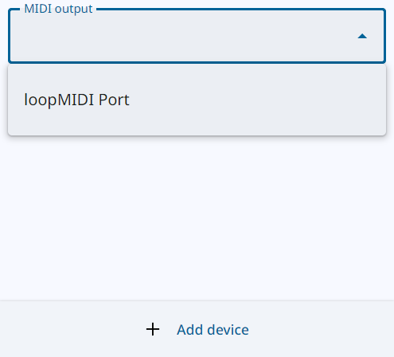
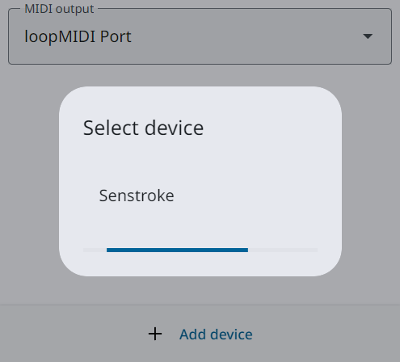
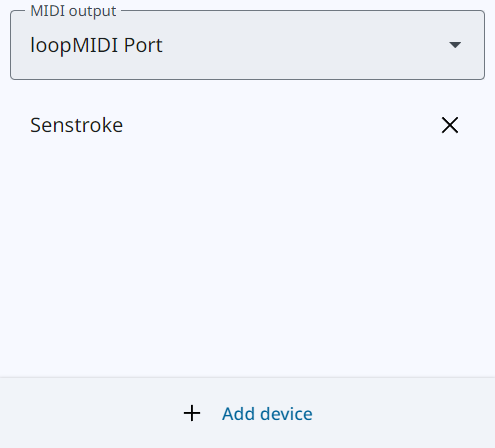

# BLE-MIDI Bridge

A simple portable app which permits to connect one or multiple Bluetooth devices and send their MIDI messages to a MIDI port.\
In other terms, it's a way to use Bluetooth MIDI devices with any DAW or virtual instrument software.

It's a one way communication, SysEx excluded, and it relies on web APIs, using Electron framework.

Download: [Windows only](https://github.com/Maxime-J/BLE-MIDI-Bridge/releases/latest/download/ble-midi-bridge-windows-x64.zip)\
(It could be bundled for other OSs but it shouldn't be needed, see Context below)

## Usage
Pretty self-explanatory:

| MIDI port selection | Device selection | Working state |
| :---: | :---: | :---: |
|  |  |  |

No system coupling needed.\
No specific order to follow.

MIDI port can be freely changed.\
Devices are removed if disconnected, and the disconnection can be triggered from the app.\
Closing the app properly disconnect all devices.

## Prerequisite
A loopback virtual midi port is most likely needed.\
LoopMIDI can be used https://www.tobias-erichsen.de/software/loopmidi.html

## Context
macOS has a top notch MIDI support, and BLE-MIDI is natively supported.\
Most Linux distributions don't support BLE-MIDI by default, but bluez can be recompiled to enable it.

Windows is another thing, BLE-MIDI is supported only through UWP, which leaves out the majority of music softwares.

Some solutions exist though:\
-Sonar, a DAW which can use MIDI through UWP.\
-MIDIberry, a bridge app available in Microsoft store.\
-KORG BLE-MIDI driver, a proprietary driver often mentionned as working with non KORG products.\
-MidiListUWP.

But in my experience, either it was:\
not fully working or not working at all, limited to one device in free version, not straightforward to use.\
I'd like to mention FlexiBLE MIDI too, a tool which gave me the concept idea, but very limited in terms of BLE-MIDI/MIDI implementation.

BLE-MIDI Bridge is a working alternative, with different limitations and advantages.

## About timing
The first MIDI message of a received packet is sent as soon as possible\
and the eventual following ones are sent respecting the timestamps.

## Libraries used
Google Material Web, slightly modified for styling needs (see patch in .yarn folder).

BLE-MIDI parser was written inspired by skratchdot ble-midi library,\
with performance in mind, fixed unhandled timestamp situation and better MIDI support.